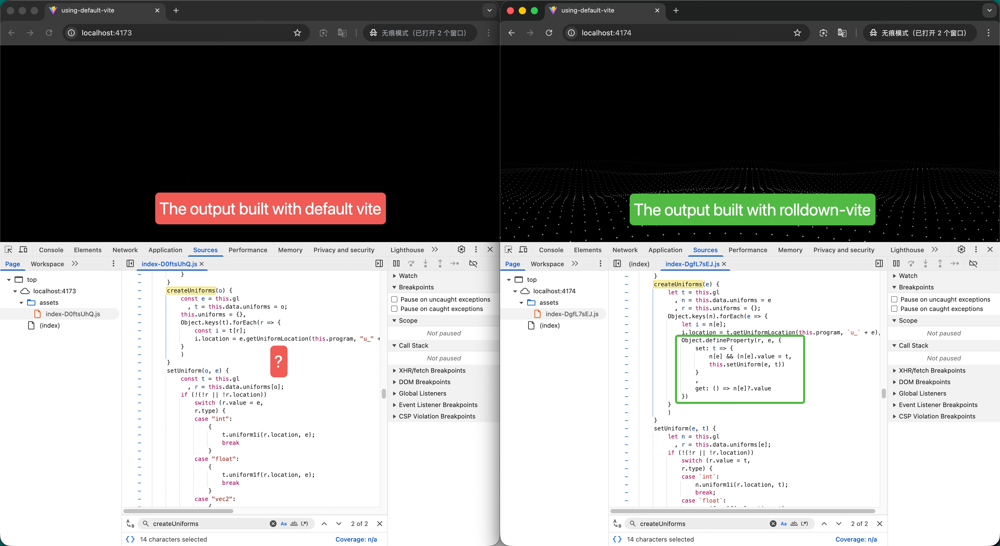

[中文](./README-zh.md)

## Vite Build Issue: Source Code Lost After Build

### Problem Description

When creating a project with `yarn create vite` using the default Vite bundler, source code is lost in the build output. However, when using `rolldown-vite` as an alternative bundler, everything works correctly.

|                              | Default Vite | Rolldown Vite |
| ---------------------------- | ------------ | ------------- |
| `yarn dev`                   | ✅           | ✅            |
| `yarn build && yarn preview` | ❌           | ✅            |

### Repository Structure

This repository contains two projects with completely identical source code, except for their `package.json`:

- **`using-default-vite/`** - Uses the default Vite bundler
- **`using-rolldown-vite/`** - Uses Rolldown-based Vite

### Reproduce Steps

1. Clone the repository

2. Build with default Vite and preview:

   ```bash
   cd using-default-vite
   yarn install
   yarn build && yarn preview
   ```

3. Build with rolldown-vite and preview:

   ```bash
   cd using-rolldown-vite
   yarn install
   yarn build && yarn preview
   ```

4. Compare the build outputs:

   - Check the generated files in the browser's Source panel and search for the `createUniforms` keyword

   
